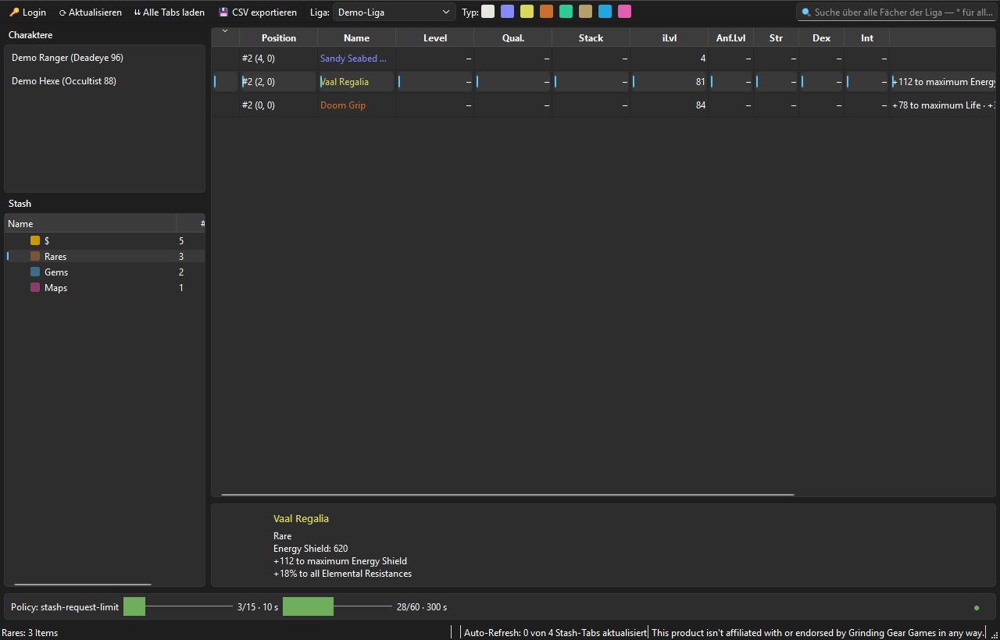
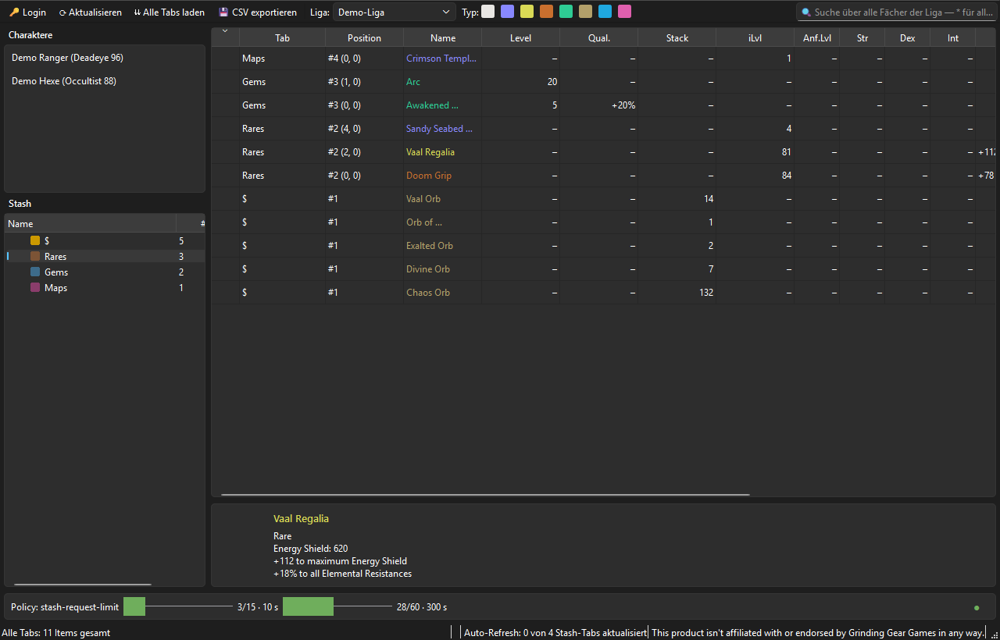
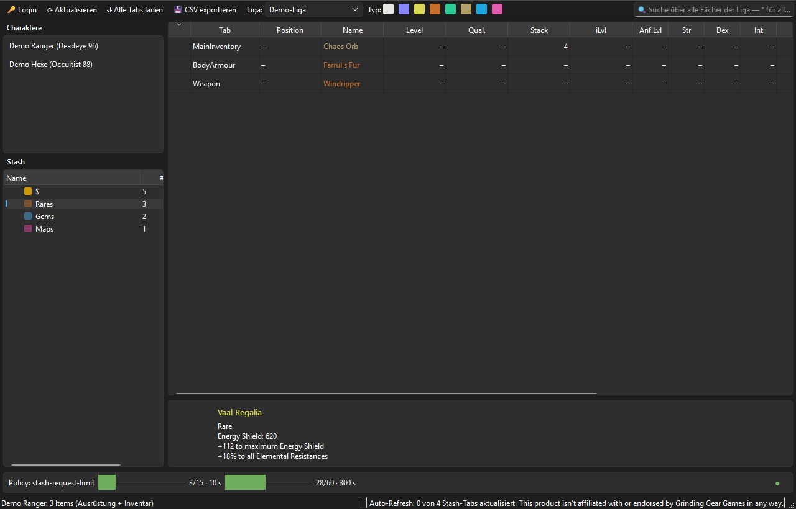

# PoE-VIEW2

Ein Desktop-Tool für **Path of Exile**: zeigt deine Charaktere und
Stash-Tabs über die offizielle GGG-API an, durchsucht sie liga-weit und
fächerübergreifend, und hält alles automatisch, aber rate-limit-schonend,
aktuell — mit Offline-Fallback, falls GGG einmal nicht erreichbar ist.

Login läuft ausschließlich per OAuth2 direkt gegen `api.pathofexile.com`
— PoE-VIEW2 bekommt dein Passwort nie zu Gesicht, und keine dritte Partei
hat Zugriff auf deine Daten. Das Access-Token liegt sicher im Windows
Credential Manager.

## Screenshots

*Alle Screenshots zeigen synthetische Demo-Daten ("Demo-Liga"), keinen
echten Account.*

**Stash-Ansicht** — Item-Tabelle mit Mods, Item-Detail-Panel und dem
Live-Rate-Limit-Dashboard unten:



**Liga-weite Aggregat-/Suchansicht** — alle Fächer auf einen Blick, Tab-
und Positions-Spalte zeigen die Herkunft jedes Items:



**Charakter-Ansicht** — Ausrüstung und Inventar wie ein Stash-Fach
durchsuchbar:



## Features

- **Login per OAuth2 (PKCE)** direkt gegen die offizielle GGG-API — kein
  Passwort läuft jemals durch PoE-VIEW2, das Access-Token liegt sicher im
  Windows Credential Manager (nie als Klartextdatei).
- **Stash-Baum** mit Ordnern, Spezial-Tabs (Map-/Unique-Stash) automatisch
  nach Sektion bzw. Kategorie gruppiert.
- **Item-Tabelle** mit Icon, Herkunfts-Fach, Position (Tab + Gitter-
  Koordinate — unterscheidet auch gleichnamige Fächer), Name, Typ, Level,
  Qualität, Stack-Größe, iLvl, Anforderungen (Level/Str/Dex/Int) und Mods.
- **Excel-artige Spalten-Filter** per Rechtsklick auf einen Spaltenkopf
  (z. B. `>=20` für Quality, `<45` für iLvl).
- **Liga-weite Suche** über alle bereits geladenen Fächer *und*
  Charaktere gleichzeitig — `*` als Suchtext zeigt bewusst alles, gedacht
  für den Komplett-Export einer ganzen Liga.
- **Typ-Filter** (Normal/Magic/Rare/Unique/Gem/Currency/Divination Card/
  Sonstige) als farbige Checkboxen neben dem Liga-Dropdown.
- **Charakter-Ansicht**: Ausrüstung + Inventar eines Charakters in
  derselben Tabelle, genauso durchsuch- und filterbar wie ein Stash-Fach.
- **CSV-Export** der gerade sichtbaren (gefilterten) Items.
- **Automatischer Hintergrund-Refresh**: hält das gerade geöffnete Fach
  bzw. den gerade angezeigten Charakter laufend aktuell und füllt
  nebenbei nach und nach den Rest der Truhe — ohne das Rate-Limit für
  eigene Klicks zu verbrauchen.
- **Offline-Modus**: Bei GGG-Wartung oder Netzausfall zeigt die App
  automatisch den letzten bekannten Cache-Stand, deutlich als solcher
  markiert (📴), statt einfach leer zu bleiben.
- **Live-Dashboard fürs Rate-Limit** (Regeln, aktuelle Auslastung,
  Sperren) — nie mehr raten, wie viel API-Budget noch übrig ist.
- **Rohdaten-Mini-Viewer** je Stash-Tab für alle, die der Anzeige nicht
  trauen und das rohe JSON sehen wollen.

## Tech-Stack

- Python 3.12+, [PySide6](https://doc.qt.io/qtforpython/) (GUI),
  [httpx](https://www.python-httpx.org/) (HTTP),
  [pydantic v2](https://docs.pydantic.dev/) (Datenmodelle),
  [keyring](https://pypi.org/project/keyring/) (Token-Speicherung)
- OAuth2 mit PKCE gegen die offizielle GGG-API (kein Client-Secret nötig)

## Setup

```bash
git clone https://github.com/peterm2024/PoE-VIEW2.git
cd PoE-VIEW2
python -m venv .venv
.venv\Scripts\activate          # Linux/Mac: source .venv/bin/activate
pip install -r requirements.txt
copy .env.example .env          # Linux/Mac: cp .env.example .env
python main.py
```

Vor dem ersten Start `.env` ausfüllen:

- **`POE_CLIENT_ID`** — eine eigene, bei GGG registrierte OAuth-Client-ID
  (public client, PKCE, kein Secret). Registrierung:
  <https://www.pathofexile.com/developer/docs/authorization>. Der in
  `.env.example` eingetragene Redirect-Port (`64338`) muss mit dem bei
  der Registrierung hinterlegten Redirect-URI übereinstimmen.
- **`POE_CONTACT_EMAIL`** — Pflichtfeld laut GGG-API-Richtlinien für den
  User-Agent-Header. Bleibt ausschließlich lokal in der `.env`, landet
  nirgends im Repository oder in Log-/Cache-Dateien.

Beim ersten Start öffnet ein Klick auf "🔑 Login" den Standard-Browser
für den GGG-OAuth-Login; danach bleibt PoE-VIEW2 bis zum Ablauf des
Tokens (von GGG vorgegeben) eingeloggt.

## Tests

```bash
pytest
```

Die Test-Suite deckt Datenmodelle, API-Client, Rate-Limiter, Worker und
sämtliche UI-Logik (ohne echte Netzwerk-Calls, per Monkeypatching) ab.

## Dokumentation

- [docs/ARCHITEKTUR.md](docs/ARCHITEKTUR.md) — Architektur-Entscheidungen
  und das Zusammenspiel der Komponenten.
- [FALLSTRICKE_UND_WORKAROUNDS.md](FALLSTRICKE_UND_WORKAROUNDS.md) —
  jede gelöste technische Hürde und jeder gefundene GGG-API-Sonderfall,
  samt Ursache und Lösung.

*Hintergrund:* Der Vorgänger *PoE-VIEW* war ursprünglich als
LabVIEW-Anwendung geplant. Mit KI-gestützter Entwicklung ließ sich
dieselbe Idee in Python deutlich schneller und robuster umsetzen — das
LabVIEW-Vorhaben ist deshalb bis auf Weiteres zurückgestellt.

## Status

PoE-VIEW2 ist im täglichen Gebrauch: Login, Stash-/Charakter-Browsing,
Suche, Filter, CSV-Export, Auto-Refresh und Offline-Fallback
funktionieren. Als Ein-Personen-Community-Projekt ohne Anspruch auf
Vollständigkeit gegenüber der offiziellen PoE-Website — Bugs und fehlende
Ecken sind erwartbar, Issues/PRs willkommen.

## Lizenz

[MIT](LICENSE)

## Disclaimer

This product isn't affiliated with or endorsed by **Grinding Gear Games**
in any way.
