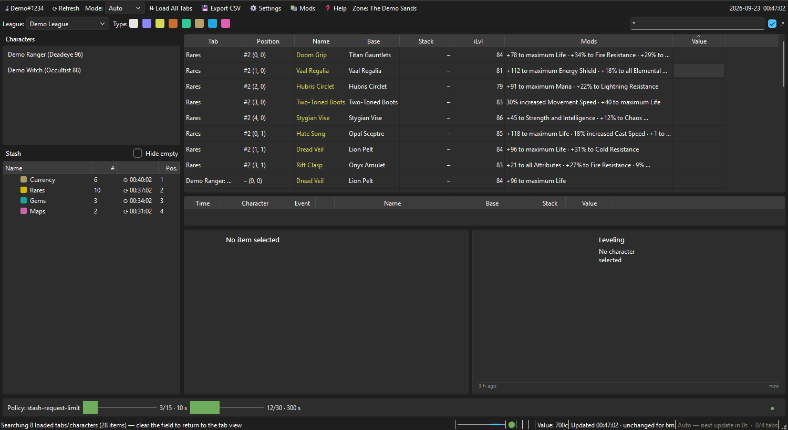
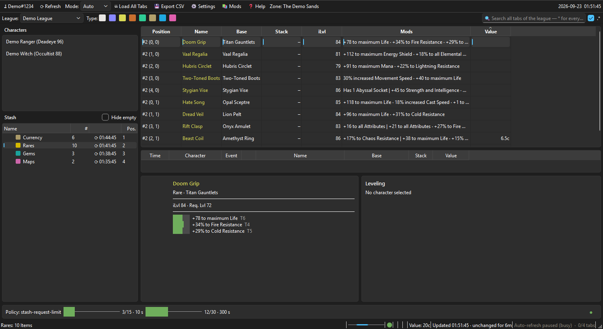
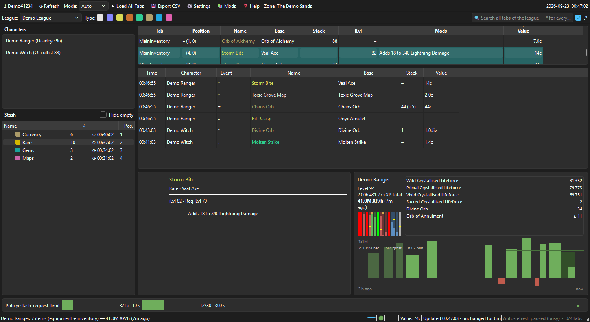

# PoE-VIEW2

[](https://github.com/peterm2024/PoE-VIEW2/releases)
[](LICENSE)

A desktop tool for **Path of Exile**. It displays characters and stash
tabs through the official GGG API, searches them league-wide across all
tabs, and keeps the data up to date automatically without exhausting the
API rate limit. If the GGG API is unreachable, PoE-VIEW2 keeps working
from the local cache.

Login runs via OAuth2 directly against `api.pathofexile.com`. PoE-VIEW2
never sees your password, and no third party is involved in the login.
The access token is stored in the Windows Credential Manager. The
account button in the toolbar offers "Log out" once you're signed in —
this only removes the locally stored token; it does not revoke the
authorization on GGG's side. To fully revoke it, do that from your GGG
account settings.

## Screenshots

*All screenshots show synthetic demo data, not a real account.*

League-wide search with `*`: stash tabs and characters appear together
in one table, with the Tab column showing where each item came from.
Type filters are above, the rate-limit dashboard below. The Value column
holds the poe.ninja price; the table starts sorted by it, cheapest
first.



A single stash tab with an item selected; its mods are shown in the
detail panel below.



A character inventory right after a refresh: rows that are new or
changed are highlighted, items that disappeared stay visible for one
cycle in grey and struck through. The panel underneath logs what moved
through the inventory of every character — pulled open here, collapsed
to a single line by default. On the right, the levelling panel shows gem
progress and the last three hours of experience.



## Features

### Browsing and searching

- **OAuth2 login (PKCE)** against the official GGG API. The access
  token is stored in the Windows Credential Manager, not in plain text
  on disk.
- **Stash tree** with folders; special tabs (map and unique stash) are
  automatically grouped by section or category.
- **Item table** with icon, source tab, position (tab number and grid
  coordinate, distinguishing tabs with the same name), name, base type,
  level, quality, stack size, item level, requirements (level, Str,
  Dex, Int), mods, and value.
- **Configurable columns**: which columns are shown and in what order is
  set either in the settings dialog (checkboxes and drag & drop) or via
  a quick toggle in the header's right-click menu. The choice is saved
  between sessions.
- **Column filters** via right-click on a column header, supporting
  comparison expressions such as `>=20` for quality or `<45` for item
  level, with autocomplete over the values actually present in that
  column.
- **Search like the in-game stash search**: several keywords separated
  by spaces must all match, so `life resistance` finds items carrying
  both even though the two words never stand next to each other.
  Quotation marks hold a phrase together (`"maximum life"`), `ilvl:84`
  and `tier:16` match exactly that item level or map tier, and `Ctrl+F`
  jumps to the field. **Regular expressions** are on by default (toggle
  `.*`), so patterns built on sites like poe.re work unchanged — sockets
  are indexed in the in-game notation (`R-R-G`), making link patterns
  such as `r-r-g|r-g-r|g-r-r` work directly. Searched is everything the
  item says about itself, down to the names of the gems socketed into
  it.
- **League-wide search** across all loaded tabs and characters at once.
  `*` as the search text lists the entire holdings, useful for
  exporting a whole league.
- **Type filters** for Normal, Magic, Rare, Unique, Gem, Currency,
  Divination Card, and Other, shown as color-coded checkboxes next to
  the league selector.
- **Multi-selection in the stash tree**: Ctrl- or Shift-click several
  tabs, or pick a folder, to view their items together. This shows only
  what is already cached and never triggers a fetch of its own; tabs
  that have never been loaded are named in the status bar instead.
- **CSV export** of the visible, filtered items or of just the selected
  rows — from the toolbar or the right-click menu of the table, the
  stash tree, and the character list. The file carries the full item
  detail: position, requirements, sockets and links, every mod category,
  influences, flags such as mirrored or fractured, note, and value. The
  complete, unmodified API object per item is available as an optional
  extra column.

### Item and character views

- **Character view**: equipment and inventory appear in the same table
  as stash items and are just as searchable and filterable.
- **Character paperdoll** (double-click a character): equipment laid out
  as a doll instead of flat table rows, including the jewels socketed in
  the passive tree.
- **Enlarged item view** (double-click an item): large icon and the full
  property and mod text without the compact detail panel's line
  clipping. Divination cards show their real artwork from GGG's own CDN
  instead of the generic icon the stash API returns for every card.
- **Item value** via poe.ninja prices: a Value column (chaos or divine
  depending on magnitude) plus the total for the visible items in the
  status bar. Covers currency, fragments, uniques (including 5- and
  6-link pricing), gems (matched exactly by level, quality, and
  corruption), divination cards, scarabs, essences, and fossils. Unknown
  prices stay empty rather than showing 0.
- **Copy for Path of Building**: right-clicking an item puts it on the
  clipboard in the game's own item text format, ready to paste into PoB.
  Aimed at stash items in particular — PoB imports characters by itself,
  but cannot reach your stash.
- **Configurable item lookups**: right-clicking an item can open it in
  reference sites you define yourself (name plus a URL template with a
  `{slug}` placeholder). Nothing is preconfigured — see
  [Data sources](#data-sources).

### Levelling

- **Experience per hour** while a character is open, at no extra API
  request — level and experience already come with the response that
  loads the equipment. It is measured per area, over the time actually
  spent in there, so hideout time does not water it down and a break
  does not make it collapse. Once the number is older than a minute, it
  says so.
- **Three-hour graph**: one bar per finished area, its width the time
  spent there. Gaps are real — no experience was made in them. Leaving a
  map and coming back puts both visits on one dark block showing the
  rate for the map as a whole, so the cost of the trip outside is
  visible. A dashed line marks the overall rate; an area that cost
  experience on balance hangs below the line in red.
- **Gem progress**: one narrow bar per socketed gem, coloured by the
  attribute it needs, showing how far it is from its next level. A full
  bar means the gem is done — and if it is full below its maximum level,
  a yellow cap marks it: gems never level up on their own, so that is
  character power waiting to be claimed.

### Staying up to date

- **Refresh modes** (toolbar dropdown), all sharing the rate-limit
  budget without exhausting it: *Auto* keeps the open view fresh and
  gradually fills in the rest of the stash, *Single* focuses only on the
  current selection, *Stash* cycles continuously through the whole
  league, and *Pause* stops all background requests.
- **Change highlighting** in the character view: rows that appeared or
  changed since the last refresh are highlighted, and items that
  disappeared stay visible for one cycle in grey and struck through. An
  item whose socketed gem just gained a level turns green instead of
  turquoise, so a gem-up is distinguishable at a glance from a genuinely
  new item.
- **Item history**: a collapsible panel below the table logs the last
  120 items that entered, left, or changed quantity in any character's
  inventory — a quick way to check what you just stashed, sold, or
  traded. Stack changes carry the difference, for example `53 (+3)`.
- **Optional zone-change trigger** (off by default): PoE-VIEW2 can watch
  the game's own `Client.txt` (read-only, path entered by you) and
  reload the open view as soon as the game reports a zone change, which
  is when GGG's API tends to publish new stash contents. The toolbar
  shows the zone most recently detected this way.
- **Offline mode**: during GGG maintenance or a lost connection, the
  app shows the last known state from the cache, clearly marked as such
  (📴). A dot in the status bar carries the same information at a
  glance: green while the API answers, red during an outage, grey before
  anything has been requested. It returns to green on its own as soon as
  a request succeeds.
- **Separate cache per account**: every GGG account keeps its own local
  data, so switching accounts never mixes up stash trees, items, or
  characters. Nothing is deleted in the process — each account keeps its
  own state, including when you switch back.
- **Rate-limit dashboard** with rules, current usage, and active locks.
- **Raw data viewer** per stash tab, showing the unmodified API
  response.

## Data sources

PoE-VIEW2 contacts these hosts, and no others:

- **`api.pathofexile.com`** — the official GGG API: login, characters,
  stash tabs, and items.
- **`web.poecdn.com`** — GGG's own CDN, for item icons and divination
  card artwork.
- **`poe.ninja`** — for the optional price display (roughly 1.2 MB per
  league, cached for up to 6 hours). Prices are unofficial community
  data. Note that SSF leagues are not tracked there at all: without
  player trading there is no market activity to derive prices from, so
  the Value column stays empty in those leagues.

Beyond that, the item lookups in the right-click menu are **empty out of
the box**. PoE-VIEW2 deliberately ships without any preconfigured
reference site, so it never opens a third-party page on its own. If you
add an entry in the settings dialog, that is your own decision — please
check that the site's operator is fine with being opened this way.

## Download (Windows, no Python required)

The [releases page](https://github.com/peterm2024/PoE-VIEW2/releases)
provides a ready-to-run `PoE-VIEW2.exe` for every version. Download and
run it — no installation or configuration needed. On first launch,
clicking "Log in" opens the GGG sign-in flow in your browser.

Windows SmartScreen warns about an "unknown publisher" for unsigned
applications. This affects any application without code signing and
can be confirmed via "More info" and "Run anyway".

## Tech stack

- Python 3.12+, [PySide6](https://doc.qt.io/qtforpython/) (GUI),
  [httpx](https://www.python-httpx.org/) (HTTP),
  [pydantic v2](https://docs.pydantic.dev/) (data models),
  [keyring](https://pypi.org/project/keyring/) (token storage)
- OAuth2 with PKCE against the official GGG API (no client secret
  required)

## Setup from source

```bash
git clone https://github.com/peterm2024/PoE-VIEW2.git
cd PoE-VIEW2
python -m venv .venv
.venv\Scripts\activate          # Linux/Mac: source .venv/bin/activate
pip install -r requirements.txt
python main.py
```

A `.env` file is not required; the client ID and contact address have
working defaults. If you fork PoE-VIEW2 and distribute it yourself, you
should override both (`.env.example` serves as a template):

- **`POE_CLIENT_ID`** — defaults to `poeview`, a public client ID
  registered with GGG. You can register your own at
  <https://www.pathofexile.com/developer/docs/authorization>; the
  redirect port `64338` must then match the redirect URI registered
  there.
- **`POE_CONTACT_EMAIL`** — the contact address sent in the User-Agent
  header. Per the [GGG documentation](https://www.pathofexile.com/developer/docs),
  it identifies the application, not the individual user, and should
  point to your own address if you distribute your own build.

On first launch, the login button opens the default browser for the
GGG sign-in. After that, the session stays valid until the token
expires; GGG determines the token's lifetime.

To build your own `.exe`, see [RELEASING.md](RELEASING.md).

## Tests

```bash
pytest
```

The test suite covers data models, the API client, the rate limiter,
the worker, and the UI logic. It requires no network access.

## Documentation

- [CHANGELOG.md](CHANGELOG.md) — changes per version.
- [docs/ARCHITEKTUR.md](docs/ARCHITEKTUR.md) — application structure
  and the reasoning behind design decisions (in German).
- [docs/api-notes/ggg-api.md](docs/api-notes/ggg-api.md) — observed
  behavior of the GGG API, including deviations from the official
  documentation (in German).
- [docs/api-notes/poe-verhalten.md](docs/api-notes/poe-verhalten.md) —
  how the game and GGG's servers behave over time, measured rather than
  assumed: when the API publishes new data, what `Client.txt` contains,
  how socketed gems gain experience, and what turned out to be wrong
  along the way (in English).
- [FALLSTRICKE_UND_WORKAROUNDS.md](FALLSTRICKE_UND_WORKAROUNDS.md) —
  solved technical hurdles with cause and fix (in German).

## Status

PoE-VIEW2 is in daily use. Login, stash and character views, search,
filters, CSV export, refresh modes, price display, levelling display,
and offline mode all work. The project is developed by a single person
and makes no claim to completeness compared to the official PoE website.
Bug reports and pull requests are welcome.

## License

[MIT](LICENSE)

## Disclaimer

This product isn't affiliated with or endorsed by **Grinding Gear Games**
in any way. It is likewise not affiliated with or endorsed by
**poe.ninja**, whose publicly available price data the optional value
display builds on.
